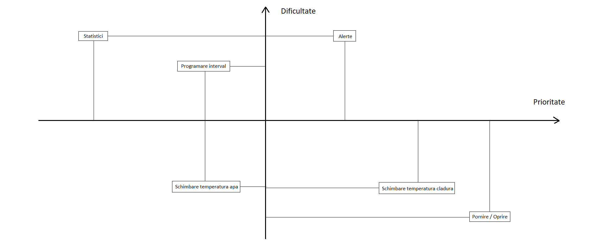

# MQTT Heating System
This project exposes an MQTT API that should manage/observe a heating system.

# Document de analiză a cerințelor clientului

## Scopul aplicației
Aplicația are rolul de a ajuta oamenii să fie mai aproape de centralele lor. Pe timp de iarna, functia de ”control remote” este foarte importanța deoarece faciliteaza stabilirea temperaturii optime pana la sosirea oamenilor în casa, astfel nemaifiind nevoie sa aștepte incalzirea acesteia. De asemenea, alertele vin în sustinerea utilizatorului întrucât îl atentioneaza când apare o defecțiune neprevăzută a centralei, acesta putand apela imediat la un serviciu autorizat.

### Obiectivele aplicației:
- Schimbare temperatura caldura
- Schimbare temperatura apa
- Programare interval
- Alerte
- Control de la distanta

### Grupul țintă
Utilizatori casnici.

### Colectarea cerințelor
Datorită problemelor de termoficare din capitala, estimam ca numărul de centrale vândute în perioada urmatoare o să crească, așa ca ne-am gandit sa venim in ajutorul oamenilor creandu-le posibilitatea de a controla mai usor centrala, acesta fiind un moment oportun pentru crearea unei astfel de aplicatii.

### Interpretarea și prioritizarea cerințelor
- Utilizatorul poate opri/porni centrala.
- Utilizatorul poate modifica temperatura.
- Utilizatorul poate vedea statistici de utilizare a apei si gazului.
- Utilizatorul poate fi alertat daca se depaseste o anumita limita lunara sau daca centrala are o defectiune.
- Utilizatorul poate crea rutine pentru centrala.
 
## Gruparea cerințelor
In primul rand vom implementa functionalitatea de baza (pornirea si oprirea centralei). Acestea sunt destul de ușor de implementat, și acest feature e de folos tuturor utilizatorilor.
Dupa aceea vom implementa alertele, statisticile si in final rutinele.

## Prioritati
Se pot vedea si la issues.

- Pornire / Oprire 10/10
- Schimbare temperatura caldura 10/10
- Schimbare temperatura apa 10/10
- Programare interval 8/10
- Alerte 8/10
- Control de la distanta 10/10

## Plot the issues


# Setting up a development environment

## For the server
- Install [poetry](https://python-poetry.org/) and [mosquitto](https://mosquitto.org/)
- Run `poetry install`

#### Running the server
First start `moquitto`:
```sh
mosquitto
```
Then:
```sh
./scripts/run-server.sh
```

# Contributing
- Start a new branch when you want to work on something, and give that branch a descriptive name
- Just make sure you format your code correctly(you can use `clang-format` and `cmake-format` to verify that you code is formatted correctly for the server, for the client you can run `scripts/check_autopep8.sh` or `scripts/apply_autopep8.sh`)
- Always have an issue to link your commits to
- The first line of every commit should be concise and descriptive, with a reference to the issue it's linked to, after that you can optionally have a blank line followed by as much text as you need. Try not to exceed more than 80-100 columns in your commits, example:
  ```
  Updated some info in the README (#42)

  Whatever...
  ```
- Make a PR and link your PR to the appropiate issue
